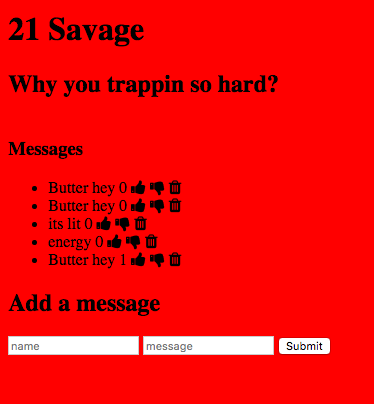

## Installation

1. Clone repo
2. run `npm install`

## Usage

1. run `npm run savage`
2. Navigate to `localhost:3000`

## Explanation

In this Express App, I used CRUD functionalities to create a message board
with the ability to give the message a thumbsup, thumbsdown, and delete.
